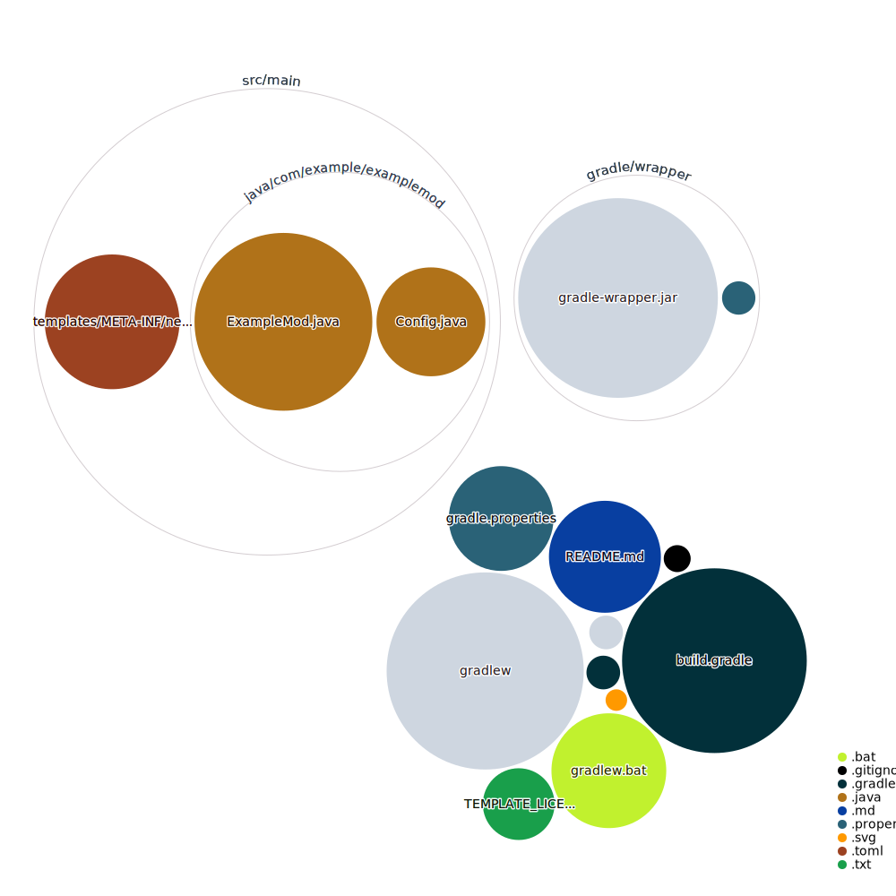

# LEAP Mod (Leveling Enhancement And Progression)

## Overview

LEAP is an in-development Minecraft mod that enhances the game's progression system by introducing a custom leveling and experience system. This mod aims to provide players with a more engaging and rewarding gameplay experience.

## Features

- Custom XP system separate from vanilla Minecraft
- Unique leveling progression
- HUD display for LEAP XP and levels

## Version Branches

Each major Minecraft version has its own branch in this repository. This allows for easier maintenance and ensures compatibility with specific Minecraft versions.

- `1.21` branch: For Minecraft 1.21.x
- `1.20` branch: For Minecraft 1.20.x
- `1.19` branch: For Minecraft 1.19.x

Always ensure you're using the correct branch for your target Minecraft version when contributing or building the mod.

## Installation

### For Players

1. Download the latest release for your Minecraft version from the [Releases](https://github.com/yourusername/leap-mod/releases) page.
2. Place the downloaded `.jar` file in your Minecraft `mods` folder.
3. Launch Minecraft with the NeoForge mod loader.

### For Developers

This repository can be directly cloned to get you started with development. Follow these steps:

1. Clone this repository:
   ```
   git clone https://github.com/yourusername/leap-mod.git
   ```
2. Open the repository in your preferred IDE (IntelliJ IDEA or Eclipse recommended).
3. Run `gradlew genEclipseRuns` (for Eclipse) or `gradlew genIntellijRuns` (for IntelliJ IDEA) to generate run configurations.

If you encounter missing libraries or other issues, run:
```
gradlew --refresh-dependencies
```
To reset everything (this does not affect your code), run:
```
gradlew clean
```

## Building and Running

To build the jar file:
```bash
gradlew build
```

To run the client:
```bash
gradlew runClient
```

To run the server (Server files will be in the `/run` directory):
```bash
gradlew runServer
```

To run both client and server:
```bash
gradlew runClient runServer
```

## Mapping Names

By default, this mod uses the official mapping names from Mojang for methods and fields in the Minecraft codebase. These names are covered by a specific license. All modders should be aware of this license. For the latest license text, refer to the mapping file itself, or the reference copy here:
https://github.com/NeoForged/NeoForm/blob/main/Mojang.md

## Additional Resources

- [Community Documentation](https://docs.neoforged.net/)
- [NeoForged Discord](https://discord.neoforged.net/)

## Contributing

We welcome contributions! Please see our [Contributing Guide](CONTRIBUTING.md) for more details on how to get started.

## License

This project is licensed under MIT. See the [LICENSE](LICENSE) file for details.

---


